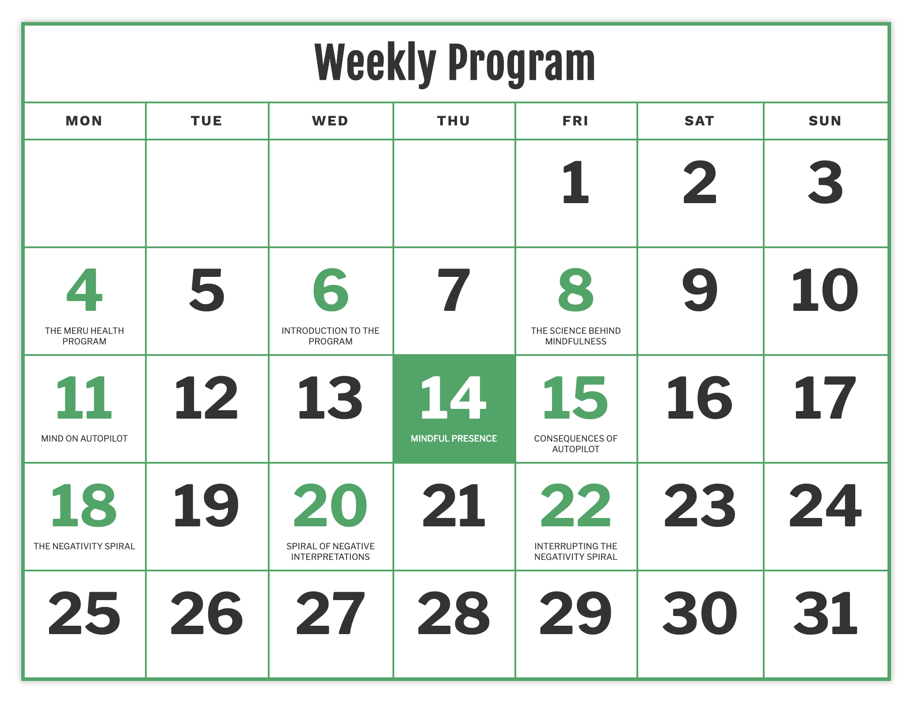

# Frontend Assignment

Your assignment is to make an app that displays 3-week treatment program. Treatment program used as input is described in JSON file and the desired output is presented in a design.

## Implementation notes

The app is built with [React](https://react.dev/) and uses [TypeScript](https://www.typescriptlang.org/). Styling is handled by [styled-components](https://styled-components.com/). Additionally, it uses:

- [Vite](https://vitejs.dev/) as a dev server and builder
- [Bun](https://bun.sh/) as a command runner
- [ESLint](https://eslint.org/) for linting (code quality)
- [Prettier](https://prettier.io/) for code formatting
- [Vitest](https://vitest.dev/), [React Testing Library](https://testing-library.com/docs/react-testing-library/intro/), and [MSW](https://mswjs.io) for testing
- [Storybook](https://storybook.js.org/) for cataloging, examining, and testing components in isolation
- [date-fns](https://date-fns.org) for working with dates

Common features/requirements which were omitted from the scope of this exercise:

- Localization (i18n)
- Accessibility (a11y)
- Responsive layout (this is currently optimized for desktop only)
- Light and dark modes

Additionally:

- The typography spec calls for [Fjalla One 700](https://fonts.google.com/?query=Fjalla+One), which (as far as I can tell) doesn't seem to be available as a webfont
- The spec doesn't really say what should happen in case "completed" activities should fall in the future. I made the call that "completed" activities in the future should _not_ be shown.

## Quickstart

Ensure you have Bun installed, and then:

```bash
# Clone this repo and navigate into repo:
git clone git@github.com:jgoney/yet-another-tech-assignment.git
cd yet-another-tech-assignment

# Install dependencies
bun install

# Run the dev server
bun run dev
```

Additional commands:

```bash
# Build app to be deployed on a server
bun run build

# Run ESLint
bun run lint

# Run Prettier
bun run format

# Run tests (in watch mode)
bun run test

# Run tests (single run)
bun run test-single

# Run tests with coverage
bun run coverage

# Check for TypeScript compiler errors
bun run tsc

# "check" is a convenience wrapper for running tests, tsc, ESLint, and Prettier all in one go
bun run check

# Launch Storybook server to examine components
bun run storybook

# Build Storybook to be deployed to a host for collaboration
bun run build-storybook
```

## Input Format

Example input for the 3-week treatment program is located in [examples/program.json](examples/program.json). The input has the following format:

```json
{
  "week<number>": [{
    "weekday": "MONDAY" || "TUESDAY" || "WEDNESDAY" || "THURSDAY" || "FRIDAY" || "SATURDAY" || "SUNDAY",
    "title": "Title for the daily activity",
    "completed": true || false
  }, ...]
}
```

Input contains three weeks. Each week contains multiple activities. Each activity has three fields: `weekday` indicates the day of week for the activity, `title` is a short description of the daily activity and `completed` indicates whether the user has done the activity.

## Output Design



Treatment program is visualised on a calendar. The calendar is always displaying current ongoing month and displays today as active with a different background color (14th in the picture above).

The treatment program starts on the first full week of the month and continues for three weeks. The activity of the day is displayed under the day number. The day number will have different color depending on whether it has an activity or not.

If a user has not completed an activity in the past, the activity will be moved to the current day. There can be only one activity per day. Thus if there are multiple incomplete activities in the past, the first incomplete activity will be displayed today, the second tomorrow, and so forth. For the previous days only completed activities will be displayed.

Your app should match the design in the picture above using the following specs:

### Colors

- Black: `rgba(0, 0, 0, 0.8)`
- Green: `rgb(93, 175, 116)`
- White: `rgb(255, 255, 255)`

### Text Styles

- `h1` [Fjalla One 700](https://fonts.google.com/?query=Fjalla+One) `48px / 1.3`
- `h2` [Libre Franklin 700](https://fonts.google.com/?query=Libre+Franklin) `64px`
- `h3` [Libre Franklin 400](https://fonts.google.com/?query=Libre+Franklin) `10px / 1.2`
- `th` [Work Sans 700](https://fonts.google.com/?query=Work+Sans) `16px`

## Tech

Assignment must use React. Otherwise feel free to use any tools and 3rd party libraries you like.

## Delivering

Make a pull request of your assignment and leave it open when you are done :slightly_smiling_face:

You should at least update the `README.md` with installation and running instructions. Also consider how you demonstrate that your app is working as intended.

**Remember to check that you have committed all required files and instructions before submitting the pull request** :white_check_mark: Good way to check this is to clone the repository into different folder and follow the instructions you have written to run the app.

**_You have the option to receive a compensation of 120 € (gross salary) for the work on this test project by providing your tax card and your bank account IBAN number. If you are interested in this option, please let us know via email me when you submit your solution._**
